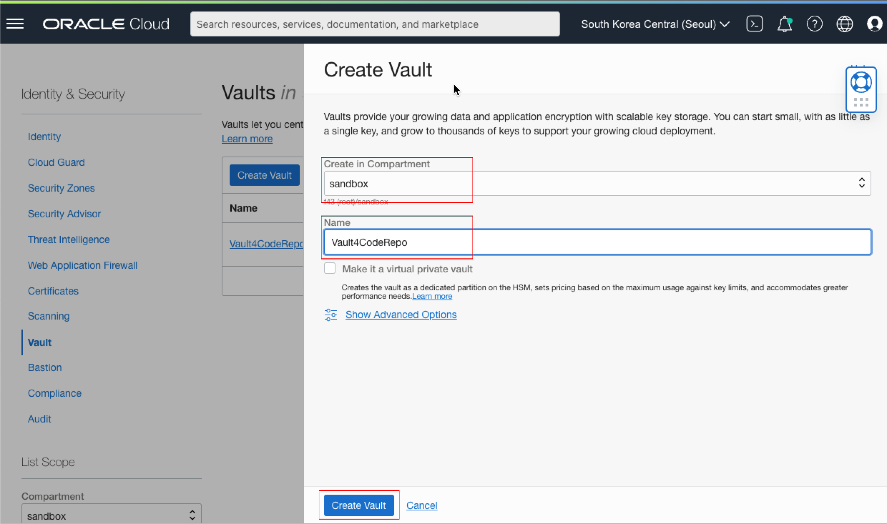
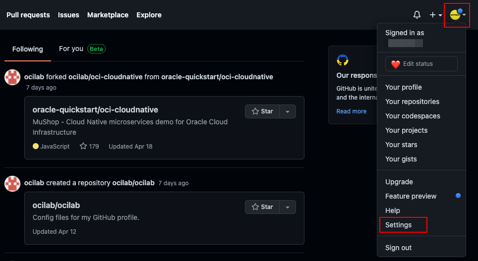
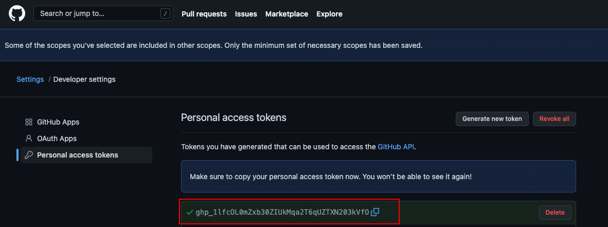
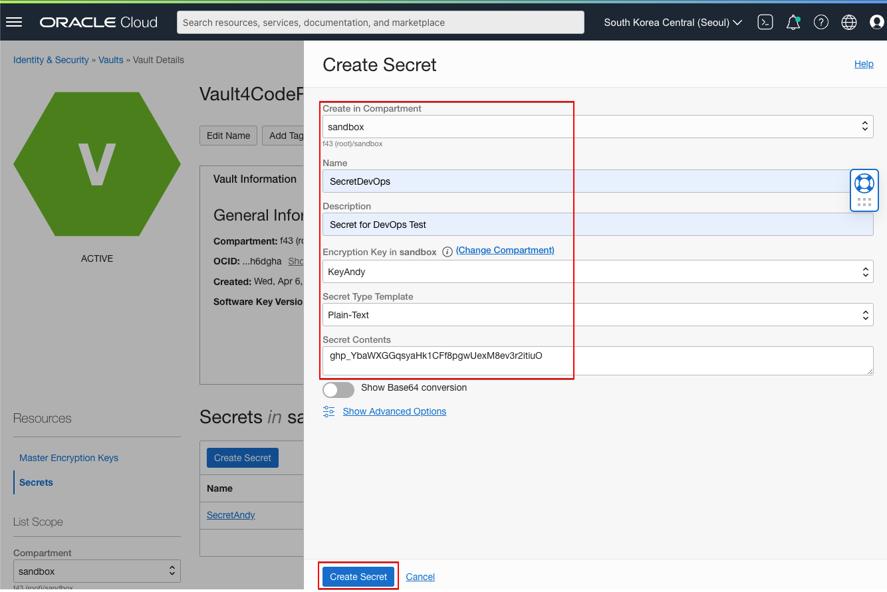
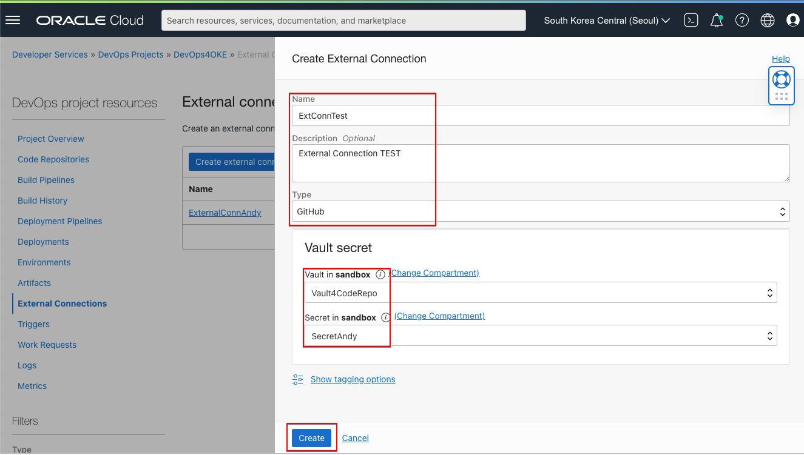
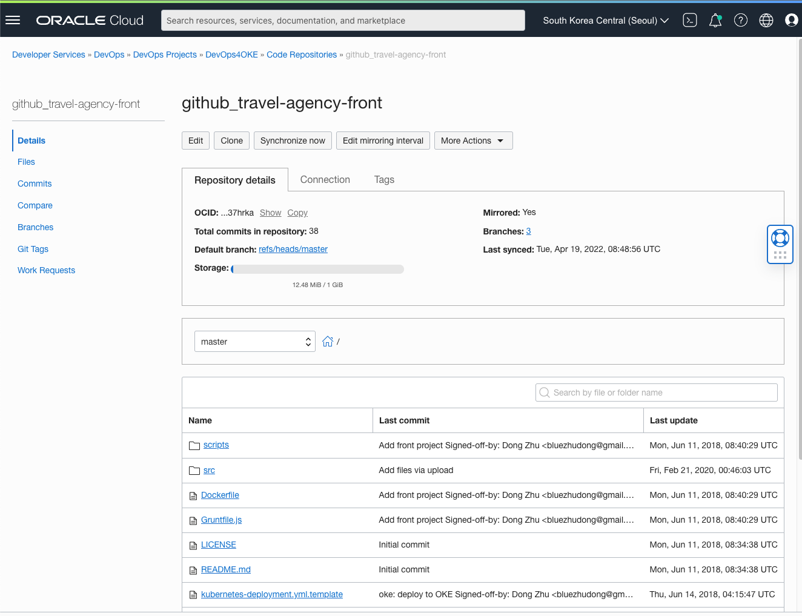

# OCI DevOps Mirror repository 사용법

> Oracle Cloud > Developer Services > **DevOps**

OCI DevOps service의 Code Repository 에서 외부 저장소(ex. github, gitlab)를 사용하는 방법을 알아보겠습니다.

## Part1 Policy (권한) 생성
DevOps 서비스의 Code Repository 와 External Core Repository 사용을 위한 Policy를 생성합니다.

- Code repository 를 위한 Dynamic group 생성
  1. `Identity & Security > Identity > Dynamic Groups` 메뉴로 이동
  2. **CoderepoDynamicGroup** 이름으로 다음 Rule을 입력 후 생성버튼을 클릭 (※ compartmentOCID는 각자 변경)
`ALL {resource.type = 'devopsrepository', resource.compartment.id = 'compartmentOCID'}`

- Dynamic group 에 DevOps resource 를 관리할 수 있는 권한 생성
  1. `Identity & Security > Identity > Policies`  메뉴로 이동
  2. DevOps 서비스를 사용하는 compartment 에서 다음 policy 생성 (※ compartment_name 은 각자 변경)
`Allow dynamic-group CoderepoDynamicGroup to manage devops-family in compartment <compartment_name>`

- Dynamic group 에 모든 리소스를 관리할 수 있는 권한 생성
  1. `Identity & Security > Identity > Policies`  메뉴로 이동
  2. root compartment 에서 다음 policy 생성
`Allow dynamic-group CoderepoDynamicGroup to manage all-resources in tenancy`

- External code repositories 를 위한 Dynamic group 생성
  1. `Identity & Security > Identity > Dynamic Groups` 메뉴로 이동
  2. **ConnectionDynamicGroup** 이름으로 다음 Rule을 입력 후 생성버튼을 클릭 (※ compartmentOCID는 각자 변경)
`ALL {resource.type = 'devopsconnection', resource.compartment.id = 'compartmentOCID'}`

- Dynamic group 에 OCI Vault secret을 조회할 수 있는 권한 생성
  1. `Identity & Security > Identity > Policies`  메뉴로 이동
  2. root compartment 에서 다음 policy 생성
`Allow dynamic-group ConnectionDynamicGroup to read secret-family in tenancy`
 
## Part 2 OCI Vault 생성
OCI DevOps service 에서 External connection 생성을 위해서 Vault secret 이 필요합니다.

- OCI Vault 및 Key 생성

   1. `Identity & Security > Vaults` 메뉴로 이동
   2. `Create Vault` 버튼 클릭
   3. Compartment 선택, Name 입력 후 하단의 `Create Vault` 버튼 클릭

   4. 생성된 Vault 클릭해서 상세보기로 이동
   5. `Master Encryption Keys` 에서 `Create Key` 버튼 클릭
   6. Protection Mode 선택(HSM은 20개 무료, Software는 무료), Name입력 후 `Create Key` 버튼 클릭

- GitHub PAT(Personal access token) 생성
  
  1. GitHub 로그인 후 설정 페이지로 이동
   
  2. 왼쪽 메뉴의 `Developer setting` 로 이동
  3. 왼쪽 메뉴의 `Personal access tokens` 로 이동
  4. `Generate new token` 버튼 클릭
  5. Note 입력, Expiration 선택, Scope 선택 후 `Generate token` 버튼 클릭
  6. 생성된 토큰은 다시 확인이 안되므로 메모 필수
   

- OCI Vault 의 Secret 생성

   1. `Identity & Security > Vaults` 메뉴로 이동
   2. 이전 단계에서 생성한 vault 클릭해서 상세화면으로 이동
   3. 왼쪽의 `Secrets` 메뉴로 이동해서 `Create Secret` 버튼 클릭
   4. Compartment 선택, Name 입력, Encryption Key 선택(이전 스텝에서 생성), Secret Centents 에 이전 스텝에서 생성한 GitHub PAT 입력 후 `Create Secret` 버튼 클릭
   

## Part 3 OCI Mirror repository 설정
OCI DevOps 서비스에서 External Connection 을 생성하고 Mirror repository 를 만듭니다.

- External Connection 생성
  
  1. `Developer Services > DevOps` 메뉴로 이동후 신규 project 를 생성
  2. project 상세화면으로 이동후 왼쪽 메뉴에서 `External Connections` 메뉴로 이동
  3. `Create external connection` 버튼을 클릭
  4. Name, Type(GitHub 선택), Vault secret 선택 후 `Create` 버튼 클릭
   

- Mirror repository 생성
  
  1. DevOps 서비스의 project 화면에서 왼쪽의 `Code Repositories` 메뉴로 이동
  2. `Mirror repository` 버튼 클릭
    + Connection 선택 : 이전 단계에서 만든 External connection 선택
    + Repository : GitHub 의 레포지토리에서 미러링할 레포지토리 선택
    + Mirroring schedule : 미러링 주기 선택 (deault는 15분)
  3. `Mirror repository' 버튼 클릭
  4. 완료
   

